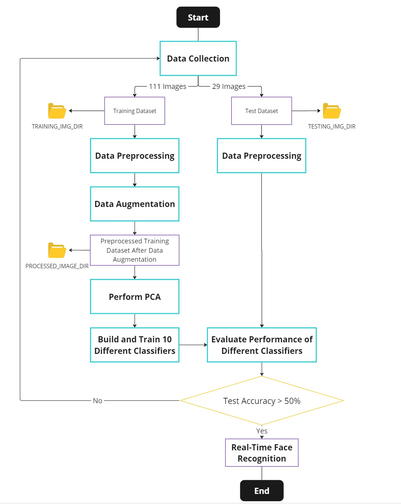

# Undergraduate-Y3S3-PCA-based-Face-Recognition
Author: [Ng Zheng Jue](https://github.com/xinjue37/), [Heng Chia Ying](https://github.com/xinying100), Tan Hong Guan, Ng Rui Qi

* This is a project developed in undergraduate Year 3 - Semester 3
* This repository consists of code to perform real-time face recognition based on the dataset given in the '[Face_Image](https://github.com/xinjue37/Undergraduate-Y3S3-PCA-based-Face-Recognition/tree/main/Face_Image)' directory. This is done by
  1) Detect the face using Cascaded Classifier
  2) Project the data into lower dimensions by Principal Components Analysis (PCA)
  3) Use KNN to recognize the face based on the training dataset in '[Face_Image](https://github.com/xinjue37/Undergraduate-Y3S3-PCA-based-Face-Recognition/tree/main/Face_Image)' directory
* This repository consists of
  * 1 Jupyter Notebook file [PCA_based_Face_Recognition.ipynb](https://github.com/xinjue37/Undergraduate-Y3S3-PCA-based-Face-Recognition/blob/main/PCA_based_Face_Recognition.ipynb) that consists of overall experimental design, development of method including training and evaluating the classifier and lastly the real-time face recognition system build.
  * [Face_Image](https://github.com/xinjue37/Undergraduate-Y3S3-PCA-based-Face-Recognition/tree/main/Face_Image) folder to store the face image for recognition
  * [Image](https://github.com/xinjue37/Undergraduate-Y3S3-PCA-based-Face-Recognition/tree/main/Face_Image) folder to store image for display in README.md
  * Library required to run the code
```
!pip install -U scikit-learn
!pip install numpy matplotlib pandas
!pip install xgboost catboost lightgbm
```

## Overall Experiment Design

